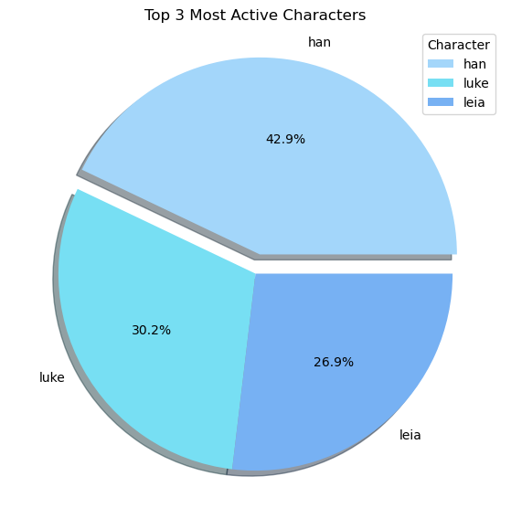

# Star Wars Script Analysis
This project analyzes the script from *Star Wars Episode V*: The Empire Strikes Back.
- Project Status: In-Progress

## Objective
To uncover narrative insights and character roles by analyzing diaglogue.

## Technologies
- Python (NumPy, Matplotlib, NLTK, NLP)
- Jupyter Notebook

## Description
This project analyzes the *Star Wars Episode V* script sourced from Kaggle:
    
    https://www.kaggle.com/datasets/xvivancos/star-wars-movie-scripts?select=SW_EpisodeV.txt

This analysis focuses on:
- character dialogue frequency
- sentiment analysis of key characters
- identifying most commonly spoken words (after removing stopwords)

## Key Findings:
- Han Solo had the most speaking lines, followed by Luke and Leia
    
- Sentiment Analysis
    - Han Solo's dialogue showed a positive sentiment
    - Luke Skywalker's showed a neutral sentiment

- After filtering out stopwords, the 20 most frequently used words were identified
    - Most common word was "don't"
    - The name "Luke" appeared frequently, reflecting his key role in the story
    - Character names like "Artoo" and "Chewie" also appeared among the top words, highlighting their memorable presence in the film
  
    
